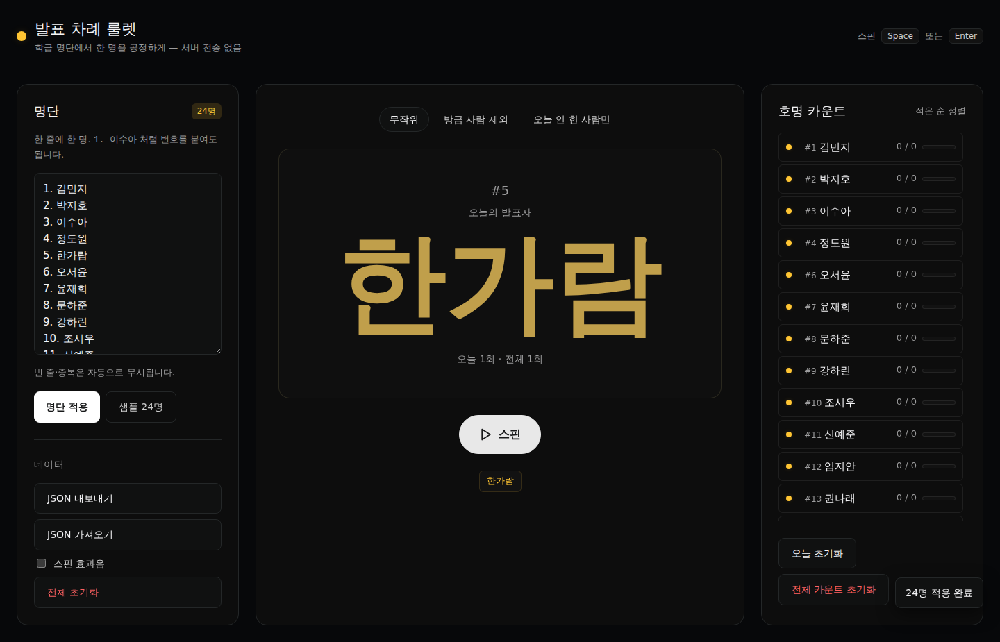

# 발표 차례 룰렛 — 이름 뽑기

> **Day 04** · 100-Day Vibe Coding Kit (#004)
>
> 초등 교실에서 발표·질문할 학생을 공정하게 뽑아주는 단일 페이지 룰렛.
> 명단을 한 번만 입력해 두면 끝. 서버 전송 없음. 사진 없음. 이름만.

## 🔗 라이브 데모

GitHub Pages: <https://989-alt.github.io/project-04-balpyo-rullet/>

## 핵심 기능

- **명단 빠른 입력** — 한 줄에 한 명. `1. 이수아` / `이수아` 둘 다 인식. 빈 줄·중복은 자동 무시.
- **3가지 추첨 모드**
  - `무작위` — 매번 전체에서 균등 추첨
  - `방금 사람 제외` — 직전 호명자 제외(연속 호명 방지)
  - `오늘 안 한 사람만` — `today=0` 인 학생만 후보, 모두 1회 채우면 자동 재시작
- **스핀 애니메이션** — 약 1초간 이름이 빠르게 교체되며 ease-out, 결과 시 노란색 강조.
  - `prefers-reduced-motion` 사용자에겐 즉시 결과.
- **공정성 카운트 표** — 학생별 오늘 / 전체 호명 횟수. 적은 순 자동 정렬. 0회 학생엔 노란 점.
- **JSON 백업·복원** — 학기 누적용. 파일명에 날짜 자동 첨부.
- **WebAudio 효과음** — 짧은 tick + 결과 팡파레. 기본 OFF, 토글로 ON. 외부 음원 0.
- **키보드** — `Space` / `Enter` 만으로 스핀. `Ctrl/Cmd+Enter` 로 명단 적용.
- **인쇄용 CSS** — `Ctrl/Cmd+P` 시 카운트 표만 흑백으로 깔끔히.

## 안 만든 것 (의도)

- 사진 업로드 / 학생 얼굴 표시 — 정책 위반.
- 서버 전송 / 외부 공유 / 로그인 / 멀티 학급 동기화 — Scope creep.
- 모둠 자동 편성 · 성적 입력 · 평어 생성 — 다른 토픽의 영역.

## 실행 방법

이 폴더는 단일 `index.html` 한 파일이 전부. 빌드 도구 없음.

### 가장 간단한 방법
```bash
python3 -m http.server 5180
# → http://127.0.0.1:5180/ 접속
```

`file://` 로 열어도 동작합니다(다만 일부 브라우저가 localStorage 격리할 수 있음).

### e2e 테스트
```bash
pip install playwright && python3 -m playwright install chromium

python3 /path/to/webapp-testing/scripts/with_server.py \
  --server "python3 -m http.server 5180 --bind 127.0.0.1" --port 5180 \
  -- python3 tests/e2e.py
```

## 데이터·프라이버시

- 학생 이름·번호·카운트는 **localStorage** 에만 저장.
- 네트워크 요청 0. 외부 CDN·폰트·분석 도구 0. 단일 HTML 자기완비.
- 학기말 백업은 사용자가 직접 "JSON 내보내기" → 학교 클라우드 폴더에 보관 권장.

## 스크린샷



## 적용한 디자인 & skill

- **디자인 브랜드**: Raycast (dark canvas, hairline cards, Inter, 6–10px 라운드) + Playstation 분위기의 노란색 강조.
- **skill 4 종**
  - `brainstorming` — MUST / SHOULD / MUST NOT 분류로 scope 정의
  - `ui-ux-pro-max` — 접근성·대비·focus-visible·reduced-motion·인쇄 CSS
  - `senior-devops` (코드 작성·디버깅으로 재정의) — vanilla JS 모듈화, sanitizeStudent / parseRoster / state 분리
  - `webapp-testing` — Playwright 9개 시나리오 (`tests/e2e.py`)

## AI

- Gemini API 사용 ✕ — 이 토픽은 결정적 무작위 추첨이라 LLM 불필요.

## 라이선스

학급용으로 자유롭게 사용·수정. 학생 정보 포함된 JSON 을 외부에 공유하지 마세요.
